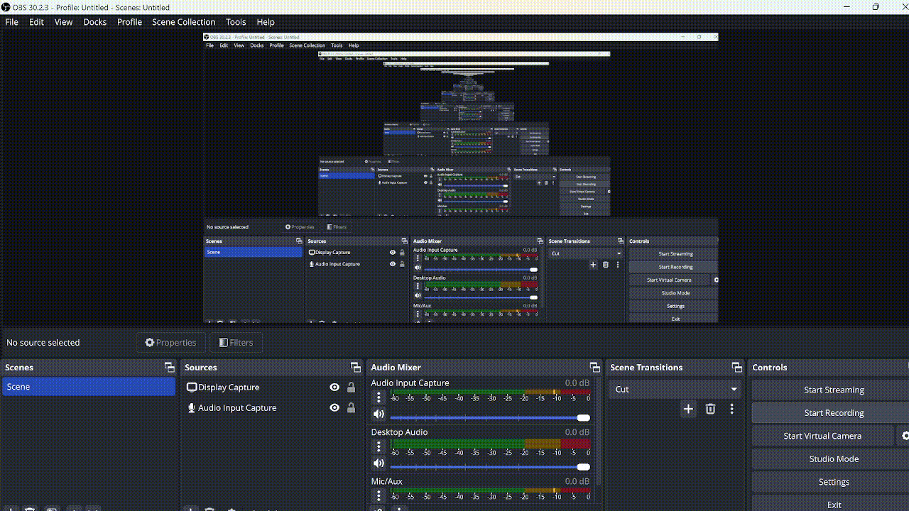

# Wa-tor Project, Made by Kyle Kinsella | C00273146

# What is wa-tor?
### Wa-tor is a population dynamics simulation. The planet of wa-tor is shaped like a torus and it is entirely covered with water. There are two types of animals in the world of wa-tor, Fish and Sharks. For more information see here: https://en.wikipedia.org/wiki/Wa-Tor

# Rules for fish
### 1. At each chronon, a fish moves randomly to one of the adjacent unoccupied squares. If there are no free squares, no movement takes place. 
### 2. Once a fish has survived a certain number of chronons it may reproduce. This is done as it moves to a neighbouring square, leaving behind a new fish in its old position. Its reproduction time is also reset to zero. 

# Rules for sharks
### 1. At each chronon, a shark moves randomly to an adjacent square occupied by a fish. If there is none, the shark moves to a random adjacent unoccupied square. If there are no free squares, no movement takes place. 
### 2. At each chronon, each shark is deprived of a unit of energy. 
### 3. Upon reaching zero energy, a shark dies. 
### 4. If a shark moves to a square occupied by a fish, it eats the fish and earns a certain amount of energy. 
### 5. Once a shark has survived a certain number of chronons it may reproduce in exactly the same way as the fish.

# I was not able to do the reproduction for the fish and sharks due to me not having enough time. 

# Below is a video of my wa-tor project running:

# Below is a video of me showing my documentation with godocs:

# If you already have godocs installed you can run the below command, below are the commands to get up and going with godocs
### godoc -http :8080
### navigate to your browser and look up localhost:8080 
### search for "KyleKinsellaWatorProject", then click into there and then you will see my docs for my wa-tor project.

# If you don't have godocs here is how to get it installed:
### 1. go into a project that you wish to document 
### 2. open a terminal and enter this command: "go install golang.org/x/tools/cmd/godoc@latest"
### 3. then you can enter this command: "godoc -http :8080"
### 4. navigate to your browser and look up localhost:8080 
### 5. search for "KyleKinsellaWatorProject", then click into there and then you will see my docs for my wa-tor project.

# How to run my code
### To run my code you must do the following:
#### 1. Download my go file
#### 2. Type in: Go run filename, change filename to be the name of the file

# Licensing
### All of this work I have completed is licensed with my below license.

This work by Kyle Kinsella is licensed under <a href="https://creativecommons.org/licenses/by-nc-sa/4.0/?ref=chooser-v1" target="_blank" rel="license noopener noreferrer" style="display:inline-block;">Creative Commons Attribution-NonCommercial-ShareAlike 4.0 International</a>
 